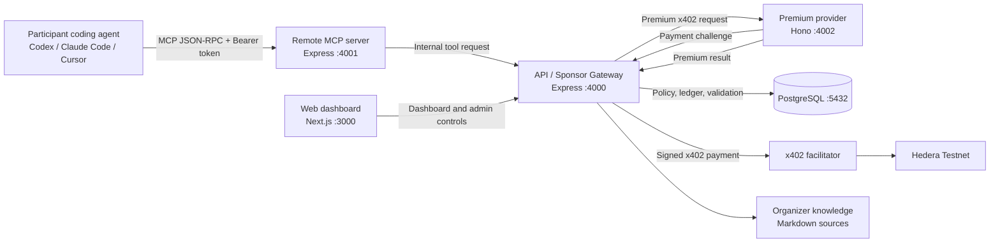

# HackRails Architecture

HackRails is an organizer-controlled gateway for sponsored MCP tools. Participants connect their coding agent to a remote MCP server, while the API authenticates the team, applies usage policy, and sponsors premium calls through x402 and Hedera.

## Quick path

1. Read the runtime topology below.
2. Follow the premium request flow to understand where policy and payment are enforced.
3. Use [Configuration](CONFIGURATION.md) for environment variables and [x402 & Hedera](X402_HEDERA.md) for live settlement.

## System context



## Runtime components

| Component | Port | Responsibility | Owns secrets? |
| --- | ---: | --- | --- |
| `apps/web` | 3000 | Admin dashboard and participant `/team` experience | No |
| `apps/mcp` | 4001 | Remote MCP JSON-RPC transport and tool catalog | No |
| `apps/api` | 4000 | Authentication, quotas, ledger, organizer knowledge, x402 buyer/sponsor flow | Yes: organizer Hedera key in live mode |
| `apps/provider` | 4002 | Premium resource server, x402 payment middleware, premium execution | No private key |
| PostgreSQL | 5432 | Events, participants, tools, usage ledger, reservations | Database credentials only |
| `organizer-knowledge/` | — | Curated event rules and judging knowledge consumed by validators | No |

### API / Sponsor Gateway

The API is the policy authority. It:

- hashes and validates participant bearer tokens;
- checks event and participant status;
- loads the current tool price and per-team quota from PostgreSQL;
- reserves event, participant, daily, and per-tool capacity;
- executes free tools locally;
- pays premium provider requests through x402;
- records `PENDING`, `SETTLED`, `FAILED`, or `REJECTED` ledger states;
- exposes admin and participant dashboard data.

The API is the only service allowed to use `HEDERA_PRIVATE_KEY`.

### MCP server

The MCP service is intentionally thin. It exposes `/mcp`, requires a bearer token for `tools/call`, validates the tool arguments, and forwards requests to `/internal/mcp/call` on the API with an idempotency key.

It does not decide whether a call is paid, permitted, or settled.

### Premium provider

The provider exposes premium HTTP resources under `/tools/:tool` and applies canonical x402 v2 Hono middleware. It advertises the Hedera exact payment requirement, executes the shared validator, and returns the result after settlement.

The provider must not receive the organizer private key. The API is the x402 buyer/sponsor.

## Request flows

### Free tool

1. Agent sends an MCP `tools/call` request with `Authorization: Bearer <participant-token>`.
2. MCP forwards the request to the API.
3. API authenticates the token and validates the payload.
4. API returns the organizer-backed event guidance response directly.
5. No x402 payment is created.

### Premium tool in demo mode

1. API authenticates the participant and locks the idempotency scope.
2. API checks all quotas and inserts a `PENDING` reservation.
3. The shared validator runs locally through the deterministic demo path.
4. API records a deterministic demo receipt and marks the usage `SETTLED`.

`DEMO_MODE=true` does not represent a blockchain payment.

### Premium tool in live mode

1. API authenticates the participant and reserves capacity atomically.
2. API calls the provider without a payment signature.
3. Provider returns the canonical `PAYMENT-REQUIRED` challenge.
4. API validates network, asset, recipient, scheme, and exact amount.
5. API signs the payment with the organizer Hedera key.
6. API retries the provider request with the canonical payment headers.
7. Provider and facilitator settle the payment on Hedera.
8. API verifies the successful settlement response.
9. API records transaction and HashScan data and marks the usage `SETTLED`.

On provider or settlement failure, the reservation is released and the usage becomes `FAILED`.

## Policy and ledger model

Premium calls are accepted only when every condition passes:

```text
current tool calls + new call <= tool.max_calls
participant spent + participant reserved + price <= participant allocation
today's pending/settled spend + price <= participant daily limit
event spent + event reserved + price <= event total budget
```

The current daily participant cap is derived from the configured premium catalog:

```text
3 × 0.01 USDC + 2 × 0.05 USDC = 0.13 USDC
```

The daily window starts at midnight in the PostgreSQL session timezone. The Dockerized PostgreSQL instance currently uses UTC.

### Usage states

| State | Meaning | Counts toward quota? | Payment executed? |
| --- | --- | ---: | ---: |
| `PENDING` | Capacity reserved while a premium request settles | Yes | In progress |
| `SETTLED` | Result and payment settlement recorded | Yes | Yes for premium |
| `FAILED` | Provider or settlement failed; reservation released | No after release | Failed or unknown |
| `REJECTED` | Policy or validation rejected before reservation | No | No |

Stale `PENDING` reservations are recovered after the configured timeout, which defaults to five minutes.

## Data ownership

| Data | Source of truth |
| --- | --- |
| Event and participant status | PostgreSQL |
| Tool price and `max_calls` enforcement | PostgreSQL at API reservation time |
| Premium provider payment amounts | Provider catalog in `apps/provider/src/index.ts` and API validation catalog in `apps/api/src/x402.ts` |
| Organizer rules and judging context | `organizer-knowledge/*.md` |
| Payment and result history | `usage_records` |

### Current configuration caveat

Tool pricing is currently duplicated between the API and provider. Do not change a database price in isolation: a future admin editor must synchronize the provider payment catalog and the API validation catalog atomically. See the product specification for the planned configurable-tool direction.

## Trust boundaries

- Browser and MCP clients are untrusted and never receive Hedera private keys.
- Participant tokens are stored as SHA-256 hashes in PostgreSQL.
- Admin operations require `X-Admin-Key`.
- The API is the only buyer/sponsor in the x402 flow.
- The provider validates payment requirements but cannot sign payments.
- PostgreSQL is inside the Compose network and is not published to the host by default.

## Repository map

```text
apps/
  api/       API, policy engine, PostgreSQL access, x402 buyer
  mcp/       Remote MCP transport and tool forwarding
  provider/  x402 resource server and premium execution
  web/       Admin and participant dashboards
packages/
  shared/            Shared types and premium validators
  hackrails-skill/  Agent Skill and participant workflows
organizer-knowledge/ Curated organizer sources
db/init/             PostgreSQL schema and indexes
docs/                Maintainer and user documentation
```

## Related documents

- [Getting started](GETTING_STARTED.md)
- [Configuration](CONFIGURATION.md)
- [MCP and Agent Skill](MCP_AND_AGENT_SKILL.md)
- [x402 and Hedera](X402_HEDERA.md)
- [Operations](OPERATIONS.md)
- [Testing](TESTING.md)
- [Security](SECURITY.md)
- [Product specification](../hackrails-product-spec.md)
