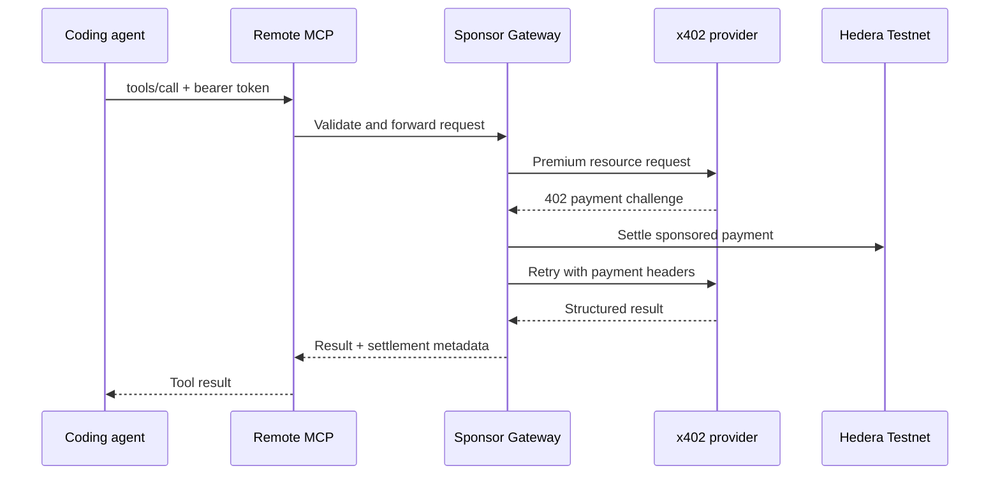

# MCP and Agent Skill

HackRails exposes a remote MCP server plus an optional Agent Skill. They solve different problems and are designed to be used together.

## Quick path

1. Download the skill ZIP from the dashboard or `GET /api/hackrails-skill/download`.
2. Add the MCP server at `http://localhost:4001/mcp` for a local Docker stack.
3. Configure the participant bearer token.
4. Use `get_event_guidance` before premium tools when required context is missing.



## MCP server

The MCP HTTP endpoint is:

```text
POST http://localhost:4001/mcp
```

Health check:

```text
GET http://localhost:4001/health
```

Tool calls require:

```http
Authorization: Bearer <participant-token>
Content-Type: application/json
```

The MCP server rejects `tools/call` requests without a bearer token before forwarding them to the API.

## Available tools

### `get_event_guidance`

Free organizer-backed information about rules, dates, tracks, prizes, submission requirements, and verified sources.

Use it when the agent needs official event context. It does not perform project strategy validation.

### `validate_project_strategy`

Premium strategy analysis against organizer rules, judging criteria, sponsor objectives, previous projects, and rejection patterns.

Required input includes:

- `event_id`;
- `project_name`;
- `project_summary`;
- `problem`;
- `target_users`;
- `selected_track`;
- `planned_integrations`;
- `current_stage`.

### `audit_submission`

Premium pre-submission audit for repository evidence, criteria, implementation signals, and blockers.

Required input includes:

- `event_id`;
- `project_name`;
- `repository_url`;
- `selected_track`;
- `project_summary`.

Video validation is intentionally out of scope for the current MVP.

## Agent Skill

The package lives in `packages/hackrails-skill/`:

```text
packages/hackrails-skill/
  SKILL.md
  workflows/demo.md
  references/safety.md
```

The skill teaches the coding agent:

- how to perform preflight checks;
- when to ask for missing required input;
- how to choose free versus premium tools;
- how sponsored usage and idempotency work;
- how to interpret structured results;
- how to avoid inventing organizer facts.

The skill does not authenticate or execute calls by itself. MCP remains the runtime tool connection.

## Configuration examples

Use the dashboard's **Import MCP** action to generate a token-specific configuration. The following examples use a placeholder environment variable rather than embedding a real token.

### Claude Code, Cursor, and compatible clients

```json
{
  "mcpServers": {
    "hackrails": {
      "type": "http",
      "url": "http://localhost:4001/mcp",
      "headers": {
        "Authorization": "Bearer ${HACKRAILS_PARTICIPANT_TOKEN}"
      }
    }
  }
}
```

### OpenCode

```json
{
  "mcp": {
    "servers": {
      "hackrails": {
        "type": "remote",
        "url": "http://localhost:4001/mcp",
        "enabled": true,
        "headers": {
          "Authorization": "Bearer ${HACKRAILS_PARTICIPANT_TOKEN}"
        },
        "timeout": 90000
      }
    }
  }
}
```

### MCP JSON-RPC example

```bash
curl http://localhost:4001/mcp \
  -H "Authorization: Bearer $HACKRAILS_PARTICIPANT_TOKEN" \
  -H "Content-Type: application/json" \
  -d '{
    "jsonrpc":"2.0",
    "id":1,
    "method":"tools/list",
    "params":{}
  }'
```

## Request behavior

- MCP generates an idempotency key when the client does not provide one.
- The API preserves the key for replay protection.
- Replaying a settled request returns the original result and transaction details.
- Replaying a pending request returns a conflict so the caller can retry safely.
- Participant tokens are entered as raw values in the dashboard; the client adds `Bearer `.

## Related documents

- [Architecture](ARCHITECTURE.md)
- [Configuration](CONFIGURATION.md)
- [Security](SECURITY.md)
