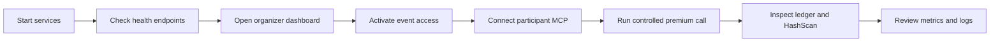

# Operations

This guide covers routine operation, health checks, live settlement inspection, and safe PostgreSQL access.

## Quick path

```bash
docker compose up --build -d --wait
docker compose ps
docker compose logs -f api provider
```

Use the admin dashboard for event controls and participant management. Use direct endpoints only for scripted verification.



## Service health

| Service | Health endpoint |
| --- | --- |
| API | `GET http://localhost:4000/health` |
| MCP | `GET http://localhost:4001/health` |
| Provider | `GET http://localhost:4002/health` |
| PostgreSQL | Docker `pg_isready` healthcheck |

Inspect the complete stack:

```bash
docker compose ps
```

## Admin controls

The admin dashboard exposes:

- event activate, pause, and resume;
- participant pause/resume;
- participant usage reset;
- participant token reveal for the current browser session;
- MCP configuration generation;
- settlement and policy metrics.

Protected requests use:

```http
X-Admin-Key: <DEMO_ADMIN_KEY>
```

## Logs

```bash
docker compose logs -f api
docker compose logs -f provider
docker compose logs -f mcp
docker compose logs -f web
```

For a premium failure, inspect API and provider logs together. The API owns policy and payment orchestration; the provider owns the x402 resource server.

## PostgreSQL inspection

Connect to the local database:

```bash
docker compose exec postgres psql -U hackrails -d hackrails
```

Useful read-only queries:

```sql
SELECT id, name, status, total_budget, spent_budget, reserved_budget
FROM events;

SELECT id, name, status, allocated_budget, spent_budget, reserved_budget, daily_limit
FROM participants;

SELECT tool_name, status, price, transaction_id, x402_state, created_at
FROM usage_records
ORDER BY created_at DESC
LIMIT 30;
```

Do not manually delete `PENDING` rows during an active request. The recovery process releases stale reservations after `USAGE_RESERVATION_TIMEOUT_MS`.

## Data lifecycle

| Operation | Effect |
| --- | --- |
| API startup | Applies schema, synchronizes the aggregate participant daily limit, then bootstraps the event if needed |
| Container restart | Preserves PostgreSQL data because of the `postgres_data` volume |
| `docker compose down -v` | Deletes the local PostgreSQL volume and all local data |

## Backups and production caution

The Compose setup does not configure PostgreSQL backups, TLS termination, secret rotation, rate limiting, or external log retention. Add those controls before using the service for a real event.

## Release checklist

- [ ] Run unit tests and typechecks.
- [ ] Run a production build.
- [ ] Run `docker compose config --quiet`.
- [ ] Verify all healthchecks.
- [ ] Confirm real Hedera configuration is present.
- [ ] Confirm no private key appears in provider or web environment.
- [ ] Verify a controlled premium flow and ledger state.
- [ ] Confirm the resulting transaction in HashScan.
- [ ] Inspect the diff before committing.

## Related documents

- [Getting started](GETTING_STARTED.md)
- [Testing](TESTING.md)
- [Security](SECURITY.md)
