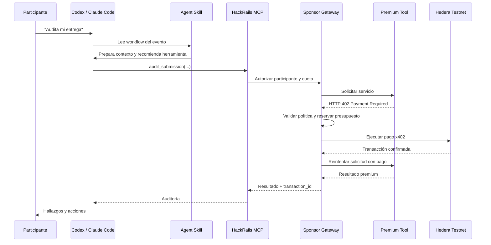
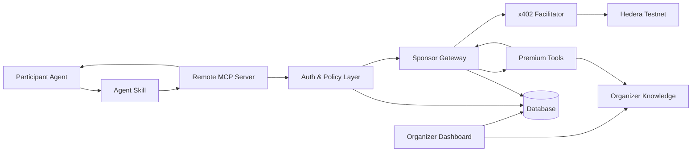

# HackRails — Product & MVP Specification

> **Documento fuente de verdad para implementación**
>
> Este archivo resume las decisiones de producto, UX, arquitectura, pagos, métricas y alcance del MVP de HackRails. Cualquier cambio importante durante la implementación debe registrarse explícitamente en una sección de decisiones o ADR.

---

## 1. Resumen ejecutivo

**HackRails** es una infraestructura para hackathons que permite a los organizadores financiar herramientas premium consumidas directamente desde los agentes de programación de los participantes, como Codex o Claude Code.

Los participantes no pagan. El organizador crea un presupuesto patrocinado y define:

- qué herramientas están disponibles;
- cuánto cuesta cada herramienta;
- cuántas veces puede usarla cada equipo;
- cuánto presupuesto máximo puede consumir cada participante;
- cuándo el acceso está activo o pausado.

Cada llamada premium se procesa mediante un flujo x402 y se liquida en Hedera Testnet. El participante recibe el resultado dentro de su agente, mientras que el organizador ve métricas de uso, consumo, impacto y transacciones.

### Pitch de una línea

> HackRails lets hackathon organizers sponsor premium MCP tools that participants access directly from their coding agents, with programmable usage limits and x402 payments settled on Hedera.

### Tagline

> **Sponsored tools for every builder.**

---

## 2. Problema

Los organizadores de hackathons suelen enfrentar:

- preguntas repetitivas sobre reglas, tracks, entregables y fechas;
- participantes que interpretan mal requisitos importantes;
- proyectos descalificados por documentación o evidencias incompletas;
- baja adopción de tecnologías de sponsors;
- poco conocimiento sobre dónde se atascan los participantes;
- soporte manual difícil de escalar;
- poca trazabilidad sobre el uso de herramientas premium;
- dificultad para financiar capacidades agentic de diferentes proveedores.

Los participantes ya cuentan con modelos potentes capaces de razonar. Por ello, HackRails **no intenta venderles razonamiento genérico**.

El valor diferencial está en dar acceso a información y capacidades que el modelo local no tiene:

- conocimiento oficial o curado del organizador;
- patrones de proyectos ganadores;
- errores frecuentes de descalificación;
- aclaraciones oficiales;
- objetivos de sponsors;
- validadores técnicos;
- tests privados o semi-privados;
- procedimientos estandarizados;
- resultados verificables;
- métricas y políticas de consumo.

---

## 3. Tesis de producto

### Lo que HackRails NO es

HackRails no es:

- un chatbot genérico para hackathons;
- un generador de prompts;
- una tienda de archivos `SKILL.md`;
- un agente que simplemente lee una URL pública;
- una plataforma de pago por descargar un ZIP;
- un reemplazo de Codex o Claude Code;
- un sistema de DRM para Agent Skills;
- un marketplace completo en el MVP.

### Lo que HackRails SÍ es

HackRails es:

> Una capa oficial de herramientas, conocimiento y servicios financiados por el organizador y consumidos por los agentes de los participantes.

La arquitectura ideal combina:

- **Agent Skill gratuito:** guía al agente, prepara contexto y decide cuándo usar herramientas.
- **MCP remoto:** expone herramientas oficiales y premium.
- **Sponsor Gateway:** aplica políticas y paga las llamadas x402.
- **Hedera:** liquida y deja trazabilidad de los pagos.
- **Dashboard:** muestra presupuesto, consumo, herramientas, equipos, métricas e historial de transacciones.

---

## 4. Actores

### 4.1 Organizador

El organizador:

- configura el evento;
- carga o aprueba las fuentes oficiales;
- define el presupuesto;
- habilita o pausa el acceso;
- configura precios y límites;
- distribuye el acceso MCP;
- observa métricas;
- revisa transacciones;
- financia el consumo.

### 4.2 Participante o equipo

El participante:

- instala o conecta el MCP;
- puede usar un Agent Skill gratuito;
- realiza consultas desde Codex, Claude Code u otro cliente compatible;
- consume herramientas gratuitas y premium;
- no gestiona wallets;
- no firma pagos;
- no recibe claves privadas;
- no paga directamente.

### 4.3 Proveedor de herramienta

En el MVP, HackRails puede operar las herramientas.

A futuro, distintos proveedores podrían publicar:

- validadores;
- datasets;
- sandboxes;
- modelos;
- APIs;
- análisis especializados;
- servicios de testing;
- revisiones de arquitectura.

### 4.4 Sponsor Gateway

El Sponsor Gateway:

- identifica evento y participante;
- verifica políticas;
- reserva presupuesto;
- maneja la respuesta `402 Payment Required`;
- firma y ejecuta el pago;
- registra la transacción;
- devuelve el resultado al MCP.

---

## 5. Modelo B2B2C

- **Comprador y pagador:** organizador.
- **Usuario final:** participante.
- **Cliente técnico:** agente o cliente MCP.
- **Unidad económica:** llamada premium.
- **Beneficio para el organizador:** soporte escalable, menos errores y métricas.
- **Beneficio para el participante:** acceso sin fricción a herramientas oficiales.
- **Beneficio para el proveedor:** micropagos por capacidad consumida.

---

## 6. Flujo principal



---

## 7. Alcance exacto del MVP

El MVP debe demostrar una sola tesis:

> Un organizador puede financiar herramientas agentic consumidas por sus participantes, aplicando políticas programables y liquidando cada uso premium mediante x402 sobre Hedera.

### Componentes obligatorios

1. Evento precargado.
2. Pantalla inicial de activación.
3. Dashboard del organizador.
4. Un MCP remoto.
5. Un Agent Skill gratuito.
6. Una herramienta gratuita.
7. Dos herramientas premium.
8. Sponsor Gateway.
9. Control de cuotas.
10. Hedera Testnet.
11. Métricas.
12. Historial de transacciones.
13. Modo demo reiniciable.

---

## 8. Evento precargado

Para el MVP no se implementará un onboarding completo.

El sistema inicia con un evento ya configurado, por ejemplo:

```text
Hedera x402 Bounty
```

### Datos precargados

- nombre;
- descripción;
- fecha de cierre;
- tracks o categoría;
- presupuesto;
- límites por equipo;
- herramientas habilitadas;
- fuentes del organizador;
- participantes demo;
- wallet pagadora;
- wallet receptora;
- configuración x402.

### Fuentes premium visibles

Ejemplo:

```text
Organizer Knowledge
✓ Previous winners dataset
✓ Official clarifications
✓ Rejection patterns
✓ Sponsor integration guidance
✓ Official submission validator
```

Estas fuentes pueden estar sembradas en la base de datos o almacenadas como archivos de demostración.

---

## 9. Estados del evento

Usar únicamente tres estados:

```text
DRAFT
ACTIVE
PAUSED
```

### DRAFT

- Evento listo para configurarse.
- MCP no disponible para participantes.
- No se aceptan llamadas.
- La pantalla principal muestra el botón de activación.

### ACTIVE

- MCP disponible.
- Herramientas gratuitas y premium habilitadas.
- Sponsor Gateway puede pagar llamadas.
- Dashboard operativo.

### PAUSED

- Nuevas llamadas bloqueadas.
- No se emite un `402`.
- No se ejecuta ningún pago.
- Métricas e historial se conservan.
- El organizador puede reanudar el evento.

---

## 10. UX del organizador

### 10.1 Pantalla inicial

```text
Hedera x402 Bounty

Status: Ready to launch

Organizer knowledge
✓ Previous winners dataset
✓ Official clarifications
✓ Rejection patterns
✓ Submission validator

Sponsored budget:       100.00 USDC
Per-team allowance:       0.20 USDC
Daily team limit:         0.13 USDC (sum of all premium tool allowances)

[ Enable participant MCP ]
```

### 10.2 Activación

Al pulsar `Enable participant MCP`:

1. Cambiar `status` a `ACTIVE`.
2. Habilitar llamadas para `event_id`.
3. Mostrar endpoint/configuración MCP.
4. Redirigir al dashboard.

No es necesario desplegar un MCP nuevo. Se usa un servidor MCP multi-tenant.

### 10.3 Dashboard

Debe mostrar:

- estado del MCP;
- presupuesto asignado;
- presupuesto consumido;
- presupuesto restante;
- participantes atendidos;
- llamadas totales;
- llamadas gratuitas;
- llamadas patrocinadas;
- consumo por herramienta;
- costo promedio por participante;
- requisitos faltantes detectados;
- proyectos listos/no listos;
- historial de transacciones;
- participantes y cuotas.

### 10.4 Pausa

Botón recomendado:

```text
[ Pause participant access ]
```

No usar “Shutdown server” ni “Delete MCP”.

Al pausar:

- `status = PAUSED`;
- nuevas llamadas rechazadas;
- datos preservados;
- se muestra `Resume participant MCP`.

---

## 11. MCP remoto

### Principio

El MCP es el núcleo técnico del producto.

Debe ser:

- remoto;
- multi-tenant;
- controlado centralmente;
- autenticado;
- actualizado sin redistribuir archivos;
- capaz de aplicar cuotas;
- capaz de devolver resultados estructurados.

### No hacer

No generar un MCP local descargable por participante en el MVP.

Eso añadiría:

- problemas de instalación;
- diferencias entre sistemas operativos;
- credenciales expuestas;
- versiones desactualizadas;
- más soporte;
- una demo más frágil.

---

## 12. Herramientas MCP del MVP

El MCP tendrá exactamente tres herramientas.

### 12.1 `get_event_guidance`

**Tipo:** gratuita.

**Objetivo:** responder preguntas básicas usando información pública y oficial.

#### Entrada

```json
{
  "event_id": "hedera-x402-2026",
  "question": "What must I show in the demo?"
}
```

#### Salida

- reglas;
- fechas;
- tracks;
- entregables;
- recursos;
- criterios públicos;
- enlaces oficiales.

#### Comportamiento económico

- no devuelve `402`;
- no consume presupuesto;
- registra una llamada gratuita para métricas.

---

### 12.2 `validate_project_strategy`

**Tipo:** premium económica.

**Precio demo sugerido:** `0.01 USDC`.

**Objetivo:** evaluar una idea contra conocimiento exclusivo o curado del organizador.

#### No debe ser

Una simple llamada a un LLM que analiza una descripción.

#### Debe combinar

```text
Idea del participante
+ reglas oficiales
+ proyectos ganadores
+ comentarios del organizador
+ patrones de saturación
+ objetivos de sponsors
+ errores frecuentes
= evaluación estratégica
```

#### Entrada

```json
{
  "event_id": "hedera-x402-2026",
  "project_summary": "Organizer-funded MCP tools for hackathon participants",
  "selected_track": "x402",
  "planned_integrations": ["x402", "Hedera"],
  "target_users": "Hackathon organizers and participants"
}
```

#### Salida esperada

```text
Strategic fit: 82/100

Strengths
- Native x402 usage
- Clear organizer value
- Good agentic commerce narrative

Risks
- Marketplace scope may be too broad
- Organizer intelligence must be concrete
- Hedera usage must be visible in the demo

Organizer-backed insights
- Previous finalists showed settlement end-to-end
- Generic AI wrappers underperformed
- Judges prioritized working flows over feature count

Recommended next actions
1. Keep only three MCP tools
2. Show HashScan transaction
3. Quantify organizer impact
```

---

### 12.3 `audit_submission`

**Tipo:** premium principal.

**Precio demo sugerido:** `0.05 USDC`.

**Objetivo:** auditar una entrega usando reglas, conocimiento del organizador y validadores.

#### Debe combinar

```text
Repositorio y entrega
+ checklist oficial
+ aclaraciones
+ patrones de descalificación
+ validadores del sponsor
+ verificación de evidencias
= auditoría reproducible
```

#### Entrada

```json
{
  "event_id": "hedera-x402-2026",
  "repository_url": "https://github.com/example/hackrails",
  "project_summary": "...",
  "demo_url": "...",
  "track": "x402",
  "transaction_links": [
    "https://hashscan.io/testnet/transaction/..."
  ]
}
```

#### Controles posibles

- repositorio público;
- README;
- licencia;
- instrucciones de instalación;
- demo disponible;
- enlaces válidos;
- evidencia del flujo `402 -> payment -> response`;
- transacción en Hedera Testnet;
- wallets pagadora y receptora diferenciadas;
- integración x402 visible;
- requisitos específicos del evento;
- errores frecuentes de descalificación;
- checklist oficial.

#### Salida esperada

```text
Submission readiness: 76%

Passed: 16
Warnings: 3
Blocking issues: 2

Blocking issues
1. No public HashScan evidence found
2. Demo does not show the initial HTTP 402 response

Organizer intelligence
- Missing on-chain evidence is a recurring rejection reason
- The organizer expects sponsored-payment policies to be visible

Recommended actions
1. Add HashScan transaction link
2. Record the full x402 lifecycle
3. Add installation instructions
```

---

## 13. Agent Skill

El Agent Skill es gratuito y complementario.

### Responsabilidades

- explicar el workflow;
- conocer las herramientas MCP;
- preparar contexto;
- evitar llamadas premium innecesarias;
- indicar cuándo usar cada herramienta;
- revisar localmente primero;
- explicar al usuario que la llamada es patrocinada;
- interpretar el resultado.

### Ejemplo de comportamiento

Antes de llamar a `audit_submission`:

1. revisar README localmente;
2. comprobar estructura;
3. buscar enlaces;
4. detectar problemas obvios;
5. solicitar datos faltantes;
6. llamar a la herramienta premium solo si aporta valor.

### Estructura sugerida

```text
hackrails-participant-skill/
├── SKILL.md
├── references/
│   └── event-overview.md
└── workflows/
    ├── understand-event.md
    ├── validate-strategy.md
    └── audit-submission.md
```

### Regla de producto

El Skill no contiene el conocimiento premium completo. El conocimiento premium vive en HackRails y se obtiene mediante herramientas MCP.

---

## 14. Sponsor Gateway

El Sponsor Gateway es el corazón económico.

### Responsabilidades mínimas

1. autenticar participante;
2. identificar evento;
3. comprobar estado;
4. comprobar herramienta habilitada;
5. comprobar presupuesto del evento;
6. comprobar cuota del participante;
7. comprobar límite por herramienta;
8. reservar temporalmente el importe;
9. ejecutar flujo x402;
10. registrar transacción;
11. actualizar métricas;
12. devolver resultado.

### Flujo

```text
MCP request
    ↓
Authenticate token
    ↓
Check event ACTIVE
    ↓
Check participant allowance
    ↓
Check tool call limit
    ↓
Reserve amount
    ↓
Call premium service
    ↓
Receive HTTP 402
    ↓
Sign and settle on Hedera
    ↓
Retry paid request
    ↓
Persist result and transaction
    ↓
Return response
```

### Rechazos

Si la política falla:

```text
Sponsored allowance exceeded.
No payment was executed.
```

No debe producirse un pago si:

- evento pausado;
- token inválido;
- herramienta deshabilitada;
- cuota agotada;
- presupuesto insuficiente;
- límite de llamadas alcanzado;
- precio superior al permitido.

---

## 15. Identificación de participantes

### Decisión

Controlar principalmente por equipo, no necesariamente por individuo.

### Sin registro completo

No implementar:

- email/password;
- verificación de correo;
- recuperación de contraseña;
- roles de equipo;
- invitaciones;
- onboarding complejo.

### Credencial mínima

Cada equipo recibe:

```text
Team Agentard
Participant ID: team_001
Access token: hxp_demo_xxxxx
Sponsored allowance: 0.20 USDC
```

Configuración MCP:

```json
{
  "mcpServers": {
    "hackrails": {
      "url": "https://api.hackrails.example/mcp",
      "headers": {
        "Authorization": "Bearer hxp_demo_xxxxx"
      }
    }
  }
}
```

### Token

Puede ser:

- JWT firmado;
- API key aleatoria;
- token almacenado como hash.

Nunca incluir:

- private key;
- seed phrase;
- credencial de wallet;
- token de gasto ilimitado.

---

## 16. Políticas de uso

Configuración demo recomendada:

```text
Event budget:              100.00 USDC
Per-team allowance:          0.20 USDC
Daily team limit:            0.13 USDC (3 × 0.01 + 2 × 0.05)

validate_project_strategy
Price:                       0.01 USDC
Max calls per team:          3

audit_submission
Price:                       0.05 USDC
Max calls per team:          2
```

### Niveles de control

```text
Presupuesto global
    ↓
Cuota por equipo
    ↓
    Límite diario agregado de llamadas premium
    ↓
Límite por herramienta
```

---

## 17. Idempotencia y concurrencia

### Idempotency key

Cada llamada premium debe incluir una clave única.

Ejemplo:

```text
team001-audit-submission-request007
```

Si se repite la petición:

- devolver resultado anterior;
- no ejecutar un nuevo pago;
- no duplicar métricas.

### Reserva de presupuesto

Antes de pagar:

1. crear registro `PENDING`;
2. reservar monto;
3. ejecutar pago;
4. cambiar a `SETTLED`;
5. confirmar consumo.

Si falla:

- cambiar a `FAILED`;
- liberar reserva;
- no descontar presupuesto.

Esto evita que llamadas concurrentes gasten el mismo saldo.

---

## 18. Métricas

Las métricas son obligatorias.

### 18.1 Métricas financieras

- presupuesto asignado;
- presupuesto consumido;
- presupuesto restante;
- costo promedio por participante;
- consumo por herramienta;
- cantidad de pagos;
- pagos fallidos;
- pagos rechazados por política.

### 18.2 Métricas de uso

- participantes atendidos;
- equipos activos;
- llamadas totales;
- llamadas gratuitas;
- llamadas patrocinadas;
- herramienta más utilizada;
- llamadas por equipo;
- tasa de uso por herramienta.

### 18.3 Métricas de impacto

Mínimo:

- requisitos faltantes detectados;
- entregas auditadas;
- entregas listas;
- entregas no listas;
- problemas bloqueantes detectados.

### Ejemplo

```text
Participants supported:       42
Sponsored calls:             137
Free calls:                  204
Requirements missing found:   89
Submissions ready:            14
Budget spent:               3.42 USDC
```

---

## 19. Historial de transacciones

Cada uso premium debe registrar:

- evento;
- participante/equipo;
- herramienta;
- precio;
- estado;
- transaction ID;
- enlace HashScan;
- timestamp;
- idempotency key;
- latencia;
- resultado asociado.

Ejemplo:

```text
Team Agentard
Tool: audit_submission
Amount: 0.05 USDC
Status: Settled
Transaction: 0.0.xxxxx@...
[ View on HashScan ]
```

---

## 20. Modo demo reiniciable

El sistema debe permitir múltiples pruebas sin contaminar la demo final.

### Restricción

Las transacciones de Hedera no se pueden borrar.

Por ello se usa una sesión de demo interna.

### Entidad conceptual

```json
{
  "event_id": "hedera-x402-demo",
  "demo_session_id": "demo-2026-07-23-001",
  "initial_budget": 100,
  "spent_in_session": 0,
  "status": "DRAFT"
}
```

### Reset demo environment

Debe:

1. pausar MCP;
2. cerrar sesión anterior;
3. crear nueva `demo_session`;
4. borrar o archivar registros locales de la sesión;
5. reiniciar participantes demo;
6. reiniciar cuotas;
7. reiniciar métricas;
8. restaurar presupuesto interno;
9. mantener fuentes y configuración;
10. volver a `DRAFT`.

### Endpoints sugeridos

```http
POST /admin/demo/reset
POST /admin/demo/seed
```

Solo disponibles con:

```text
DEMO_MODE=true
```

### Seed demo data

Opcionalmente sembrar:

```text
Participants: 41
Calls: 135
Spent: 3.36 USDC
```

Luego las llamadas reales cambian:

```text
Participants: 42
Calls: 137
Spent: 3.42 USDC
```

La UI debe identificar los datos sembrados como actividad demo.

---

## 21. Dashboard de participantes

Sección mínima:

```text
Team Agentard
Spent: 0.06 / 0.20 USDC
Strategy validations: 1 / 3
Submission audits: 1 / 2
Status: Active

Team Demo Two
Spent: 0.02 / 0.20 USDC
Strategy validations: 2 / 3
Submission audits: 0 / 2
Status: Active
```

Acciones mínimas:

```text
[ Copy MCP access ]
[ Pause access ]
[ Reset demo usage ]
```

No implementar gestión organizacional compleja.

---

## 22. Modelo de datos mínimo

### EVENT

```text
id
name
slug
description
status
total_budget
spent_budget
reserved_budget
currency
wallet_account_id
recipient_account_id
starts_at
ends_at
created_at
updated_at
```

### DEMO_SESSION

```text
id
event_id
status
initial_budget
spent_budget
reserved_budget
seeded
created_at
closed_at
```

### PARTICIPANT_ACCESS

```text
id
event_id
demo_session_id
participant_name
participant_external_id
token_hash
allocated_budget
spent_budget
reserved_budget
daily_limit
status
created_at
updated_at
```

### TOOL

```text
id
name
description
type
handler
enabled
```

### TOOL_POLICY

```text
id
event_id
tool_id
price
currency
max_calls_per_participant
daily_call_limit
enabled
```

### ORGANIZER_SOURCE

```text
id
event_id
name
type
visibility
content_location
version
enabled
created_at
```

### USAGE_RECORD

```text
id
event_id
demo_session_id
participant_id
tool_id
idempotency_key
price
status
transaction_id
hashscan_url
request_payload
result_payload
error_code
created_at
settled_at
```

### DAILY_USAGE

Opcional para simplificar consultas:

```text
participant_id
date
spent
call_count
```

---

## 23. API sugerida

### Evento

```http
GET  /api/events/:eventId
POST /api/events/:eventId/activate
POST /api/events/:eventId/pause
POST /api/events/:eventId/resume
```

### Dashboard

```http
GET /api/events/:eventId/dashboard
GET /api/events/:eventId/metrics
GET /api/events/:eventId/transactions
GET /api/events/:eventId/participants
```

### Participantes

```http
POST /api/events/:eventId/participants
POST /api/participants/:participantId/pause
POST /api/participants/:participantId/resume
POST /api/participants/:participantId/reset-demo-usage
```

### Demo

```http
POST /api/admin/demo/reset
POST /api/admin/demo/seed
```

### MCP / herramientas

```text
get_event_guidance
validate_project_strategy
audit_submission
```

### Pagos internos

```http
POST /internal/sponsor/authorize
POST /internal/sponsor/reserve
POST /internal/sponsor/settle
POST /internal/sponsor/release
```

---

## 24. Arquitectura lógica



---

## 25. Separación económica

Para la demo se deben representar actores económicos distintos:

- wallet del organizador: pagadora;
- wallet del proveedor: receptora;
- participante: beneficiario del servicio.

Aunque el equipo controle ambas wallets en Testnet, la UI y la arquitectura deben dejar clara la separación.

### Evitar

```text
Nuestra wallet paga a nuestro endpoint y vuelve a nuestra wallet
```

sin explicación.

### Mostrar

```text
Organizer Budget Wallet
    → x402 payment
    → Premium Tool Provider Wallet
    → Result delivered to participant
```

---

## 26. Seguridad y privacidad

### Seguridad

- claves privadas solo en backend seguro;
- tokens de participante limitados;
- rate limiting;
- límites por herramienta;
- validación de precio;
- idempotencia;
- logs de auditoría;
- nunca devolver secretos;
- separar rutas admin;
- deshabilitar endpoints demo fuera de `DEMO_MODE`.

### Privacidad

Por defecto:

- métricas agregadas para el organizador;
- no exponer código privado;
- no almacenar repositorios completos innecesariamente;
- consentimiento explícito para análisis;
- retención mínima;
- resultados personales visibles para el participante;
- evitar presentar el producto como vigilancia.

### Información del jurado

Permitido:

- biografías públicas;
- áreas de experiencia;
- criterios declarados;
- publicaciones;
- comentarios oficiales.

No prometer:

- preferencias privadas;
- criterios secretos;
- información privilegiada;
- manipulación de jueces.

Usar el término:

```text
Organizer-backed intelligence
```

---

## 27. Guion de demo recomendado

Duración objetivo: aproximadamente 4 minutos.

### 0:00–0:25 — Problema

Explicar:

- organizadores reciben preguntas repetidas;
- participantes incumplen requisitos;
- herramientas agentic tienen costo;
- HackRails permite financiarlas por uso.

### 0:25–0:50 — Evento precargado

Mostrar:

- nombre;
- conocimiento oficial;
- presupuesto;
- límites;
- herramientas.

Pulsar:

```text
Enable participant MCP
```

### 0:50–1:15 — Consulta gratuita

Desde Codex:

```text
¿Qué debo mostrar en la demo?
```

Se llama `get_event_guidance`.

Mostrar:

- respuesta;
- no hubo pago;
- presupuesto sin cambios.

### 1:15–2:00 — Validación premium

Desde Codex:

```text
Evalúa si nuestra idea es competitiva usando la inteligencia oficial del organizador.
```

Se llama `validate_project_strategy`.

Mostrar:

```text
402 Payment Required
Sponsor policy approved
0.01 USDC settled on Hedera
```

Luego mostrar resultado.

### 2:00–2:50 — Auditoría premium

Desde Codex:

```text
Audita la entrega y dime si estamos listos.
```

Se llama `audit_submission`.

Mostrar:

- resultado estructurado;
- bloqueantes;
- costo `0.05 USDC`;
- transaction ID.

### 2:50–3:30 — Dashboard actualizado

Mostrar:

- llamadas nuevas;
- presupuesto reducido;
- cuota del equipo;
- uso por herramienta;
- métricas;
- transacciones.

Abrir HashScan.

### 3:30–4:00 — Visión

Explicar:

> Hoy HackRails ofrece inteligencia y validación oficial. Mañana cualquier sponsor puede publicar datasets, sandboxes, modelos o herramientas y cobrar directamente por cada uso.

---

## 28. Qué NO entra en el MVP

Excluir:

- registro completo de organizadores;
- login tradicional;
- verificación de correo;
- recuperación de contraseña;
- creación de organizaciones;
- invitaciones;
- múltiples roles;
- creación dinámica de cualquier hackathon desde URL;
- generador de Agent Skills;
- marketplace de proveedores;
- múltiples eventos en producción;
- mainnet;
- MCP local;
- app móvil;
- Devpost integration;
- análisis de video;
- ejecución arbitraria de repositorios;
- scoring predictivo de ganar;
- NFT;
- token propio;
- Stripe;
- facturación tradicional;
- antifraude avanzado;
- white-labeling;
- soporte simultáneo perfecto para todos los clientes MCP;
- chat interno;
- equipos y colaboración completa;
- DRM.

---

## 29. Features opcionales si sobra tiempo

Prioridad posterior al flujo principal:

1. `review_architecture`;
2. alerta de presupuesto bajo;
3. edición visual de cuotas;
4. exportación CSV;
5. comparación entre herramientas;
6. listado “coming soon”;
7. rechazo visible por límite agotado;
8. fuentes del organizador versionadas;
9. vista de actividad por equipo;
10. retries seguros de pago.

---

## 30. Criterios de aceptación del MVP

### Evento

- [ ] Existe un evento precargado.
- [ ] Puede activarse.
- [ ] Puede pausarse.
- [ ] Puede reanudarse.
- [ ] El estado afecta realmente las llamadas.

### MCP

- [ ] Existe un servidor MCP remoto.
- [ ] Expone tres herramientas.
- [ ] La herramienta gratuita funciona sin pago.
- [ ] Las dos herramientas premium pasan por x402.
- [ ] Las respuestas son estructuradas.

### Participantes

- [ ] Cada equipo tiene token.
- [ ] Cada equipo tiene cuota.
- [ ] Se limita uso por herramienta.
- [ ] Se registra consumo.
- [ ] Una llamada rechazada no paga.

### Pagos

- [ ] Wallet pagadora y receptora separadas.
- [ ] Pago real en Hedera Testnet.
- [ ] Transaction ID persistido.
- [ ] Enlace HashScan visible.
- [ ] Idempotencia evita pagos duplicados.

### Dashboard

- [ ] Muestra presupuesto.
- [ ] Muestra uso.
- [ ] Muestra participantes.
- [ ] Muestra métricas.
- [ ] Muestra transacciones.
- [ ] Se actualiza después de las llamadas.

### Demo

- [ ] Puede resetearse.
- [ ] Puede sembrar actividad.
- [ ] El flujo completo cabe en menos de 5 minutos.
- [ ] Al menos dos pagos reales quedan visibles.
- [ ] La narrativa explica por qué x402 es necesario.

---

## 31. Orden recomendado de implementación

### Fase 1 — Flujo vertical mínimo

1. Evento precargado.
2. Participante precargado.
3. MCP con una herramienta premium temporal.
4. Sponsor Gateway básico.
5. Pago Hedera Testnet.
6. Registro de transacción.
7. Respuesta al agente.

### Fase 2 — Herramientas

1. `get_event_guidance`.
2. `validate_project_strategy`.
3. `audit_submission`.
4. Fuentes premium precargadas.

### Fase 3 — Políticas

1. cuota por equipo;
2. límite por herramienta;
3. estado activo/pausado;
4. idempotencia;
5. reserva de presupuesto.

### Fase 4 — Dashboard

1. presupuesto;
2. métricas;
3. participantes;
4. herramientas;
5. historial de transacciones.

### Fase 5 — Demo

1. reset;
2. seed;
3. Agent Skill;
4. guion;
5. HashScan;
6. video.

---

## 32. Regla de priorización

Antes de implementar una feature, preguntar:

> ¿Esta feature ayuda a demostrar que un organizador puede financiar herramientas agentic consumidas por sus participantes mediante x402?

Si la respuesta es no, no entra al MVP.

---

## 33. Riesgos principales

### Riesgo 1: parecer un wrapper de IA

Mitigación:

- fuentes exclusivas visibles;
- validadores;
- organizer-backed insights;
- resultados reproducibles;
- métricas.

### Riesgo 2: x402 artificial

Mitigación:

- pago por llamada;
- herramientas con precios diferentes;
- wallet pagadora y receptora separadas;
- dashboard;
- HashScan;
- políticas programables.

### Riesgo 3: demasiadas features

Mitigación:

- tres herramientas;
- un evento;
- dos participantes demo;
- una sola historia.

### Riesgo 4: dashboard vacío

Mitigación:

- seed demo data;
- actividad identificada como demo;
- llamadas reales que actualizan métricas.

### Riesgo 5: pagos duplicados

Mitigación:

- idempotency key;
- reserva de presupuesto;
- estados `PENDING`, `SETTLED`, `FAILED`.

### Riesgo 6: abuso de presupuesto

Mitigación:

- token por equipo;
- cuota;
- límite diario;
- límite por herramienta;
- pausa.

---

## 34. Roadmap posterior al MVP

### Corto plazo

- múltiples hackathons;
- creación guiada de eventos;
- carga de fuentes;
- herramientas configurables;
- más clientes MCP;
- auditorías más profundas.

### Medio plazo

- marketplace de herramientas;
- proveedores externos;
- revenue sharing;
- datasets premium;
- sandboxes;
- validadores de sponsors;
- presupuestos por track.

### Largo plazo

- infraestructura estándar para programas de desarrolladores;
- aceleradoras;
- bootcamps;
- comunidades;
- grant programs;
- eventos técnicos;
- consumo autónomo de herramientas por agentes.

---

## 35. Mensaje central para jurados

> HackRails does not replace the participant’s coding agent. It gives that agent access to organizer-backed knowledge, validators and premium services that it cannot produce locally. Organizers sponsor every call through programmable x402 budgets, while Hedera provides transparent settlement and auditability.

---

## 36. Frases de producto

### Descripción corta

> HackRails enables organizers to sponsor premium MCP tools that participants consume directly from their coding agents.

### Descripción extendida

> HackRails turns organizer knowledge, validators and premium resources into official agent tools. Participants use them from Codex or Claude Code without handling wallets, while organizers define quotas, fund usage and track every x402 payment settled on Hedera.

### Demo line

> Organizers provide the intelligence. HackRails provides the payment and access infrastructure. Participants focus on shipping.

---

## 37. Decisiones cerradas

- Nombre: **HackRails**.
- Mercado inicial: hackathons.
- Comprador: organizador.
- Usuario final: participante.
- Núcleo técnico: MCP remoto.
- Complemento: Agent Skill gratuito.
- Pago: patrocinado por organizador.
- Unidad económica: llamada premium.
- Liquidación: x402 sobre Hedera Testnet.
- Alcance: un evento precargado.
- Tools: una gratuita y dos premium.
- Control: token, cuota y límite por herramienta.
- Demo: reiniciable.
- Métricas: obligatorias.
- Registro completo: fuera del MVP.
- MCP local: fuera del MVP.
- Marketplace: roadmap.

---

## 38. Fuente de verdad

Este documento debe utilizarse para:

- definir el backlog;
- crear el PRD;
- diseñar arquitectura;
- generar tareas para Codex;
- validar decisiones;
- controlar scope creep;
- preparar README y demo.

Ante una duda de implementación, priorizar:

1. flujo x402 real;
2. valor para el organizador;
3. experiencia sin fricción para el participante;
4. métricas;
5. claridad de demo;
6. extensibilidad futura.
